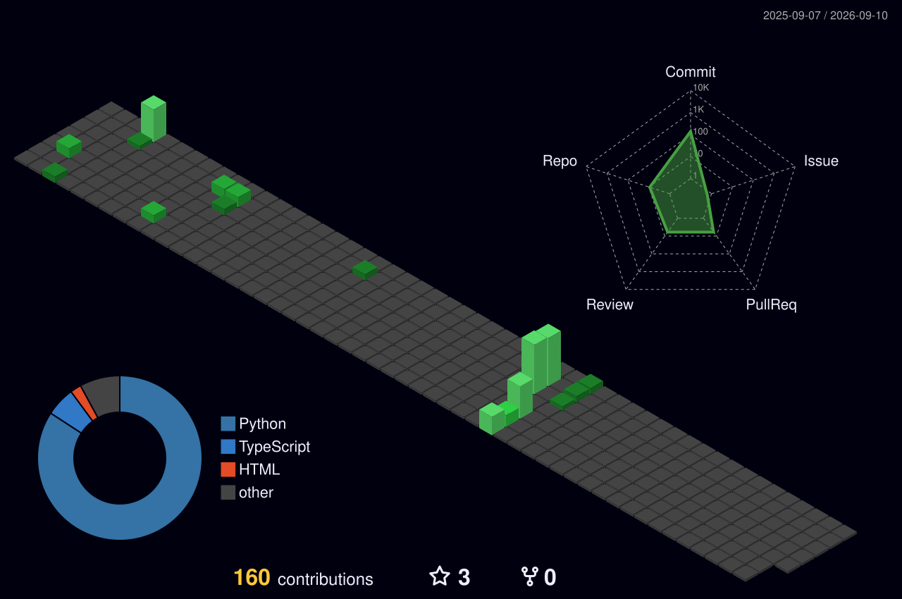

<div align="center">


# Hagan Sadina Rahman


<br/>


&nbsp;
[](https://linkedin.com/in/hagansadinarahman)
[](mailto:rahmanhagan@gmail.com)
[](https://github.com/hagans7)

</div>

---

## `$ whoami`

Just a human trying to stay useful
in the age of AI and survive in this economy
with code, curiosity, and caffeine

---

## 🚀 Featured Projects

| Project | What It Does | Stack |
|---------|--------------|-------|
| **[🛒 Retail Decision Intelligence](https://github.com/hagans7/Retail-Demand-Forecasting-Inventory-Optimization-System-)** | Demand forecasting + promotional decision engine | LightGBM · FastAPI · Docker · PostgreSQL |
| **[⚖️ Legal RAG](https://github.com/hagans7/Retrieval-Augmented-Generation-Based-Question-Answering-System-on-Policy-Documents)** | Multi-agent legal reasoning over Indonesian legal texts | Langgraph · Langchain · Neo4j · Weaviate · Langfuse |
| **[📄 Resume Matcher](https://github.com/hagans7/resume_matcher)** | AI hiring assistant with skill gap analysis | CrewAI · FastAPI · Celery · Redis · Docling |

---

## 🛠 Stack

<div align="center">

**Languages**<br>


**AI / ML / DL**<br>


**Backend, Tools & Infra**<br>


**Vector & Search**<br>


**Data & Analytics**<br>


**Visualization & BI**<br>


**UI / Prototyping**<br>


</div>

---

## 📊 GitHub Stats

<div align="center">


</div>

---

## 📈 3D Contribution Calendar

<div align="center">

<!-- Auto-generated oleh GitHub Actions, lihat .github/workflows/3d-contrib.yml -->


</div>

---

## ⌨️ Weekly Coding Stats

<!--START_SECTION:waka-->

```txt
From: 26 April 2026 - To: 03 May 2026

Total Time: 0 secs

No activity tracked
```

<!--END_SECTION:waka-->

---

## 🏆 Trophies

<div align="center">


</div>

---

## 🐍 Contribution Snake

<div align="center">

<picture>
  <source media="(prefers-color-scheme: dark)" srcset="https://github.com/hagans7/hagans7/blob/output/github-contribution-grid-snake-dark.svg" />
  <source media="(prefers-color-scheme: light)" srcset="https://github.com/hagans7/hagans7/blob/output/github-contribution-grid-snake.svg" />
  
</picture>

</div>

---

<div align="center">

**Open for AI Engineer / ML Engineer / Data Science roles — Indonesia & Remote**

[](https://linkedin.com/in/hagansadinarahman)
[](mailto:rahmanhagan@gmail.com)

<br/>

*Low specs. High hopes. Still loading, still learning. Constant updates. Still here somehow.*


</div>

